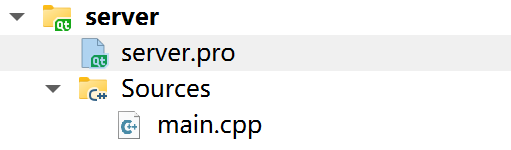
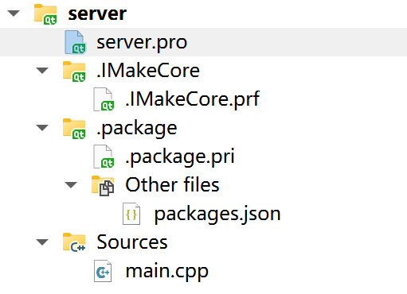
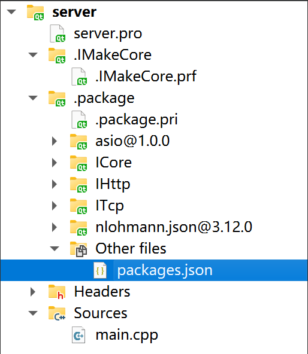
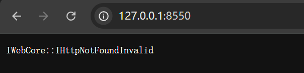
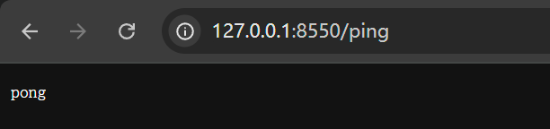
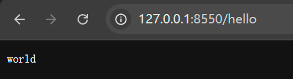
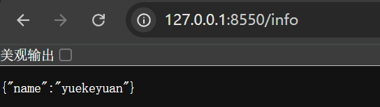

IHttpCore 又可以称为  IHttp, 他是一个基于反射和宏注解的Http框架。

想快速了解IHttpCore是怎么回事？ 这篇文档提供一个简单的视角讲述 IHttpCore 的功能。

## 一个最小的服务器

### 第一步：新建一个项目

IHttp 目前支持在 CMake 项目和Qt 项目上使用。我们以 Qt 为例。默认创建一个Qt console 项目。如下。项目的内容如下:

> server.pro
```pro
QT -= gui

CONFIG += c++11 console
CONFIG -= app_bundle

DEFINES += QT_DEPRECATED_WARNINGS

SOURCES += \
        main.cpp
```

> main.cpp
```cpp
#include <QCoreApplication>

int main(int argc, char *argv[])
{
    QCoreApplication a(argc, argv);

    return a.exec();
}
```

这里面 server.pro 中的内容我做了一些删减。

一个简单的 Qt console 项目就准备好了。

### 第二步：集成 IMakeCore

IHttpCore 依赖于 IMakeCore。IMakeCore 是一个基于CMake 和 qmake 的包管理工具,包括IHttp的很多的包都可以由IMakeCore下载导入。

用户需要安装IMakeCore以进行后续的包导入的工作。 关于 IMakeCore 的内容可以在 [IMakeCore](../IMakeCore/quick_start.md) 文档中查看。

下面默认用户已经安装和了解 IMakeCore的功能（如果不了解可以默认这个是一个类似于npm和maven, cargo 类似的包管理工具而进行后续的阅读，在实际操作的过程中再详细了解 IMakeCore）。

在项目目录 执行命令如下：

```bash
ipc init
qmake
```

`ipc init` 命令是在 server.pro 文件中添加几行代码，从而使 qt 项目能够使用 IMakeCore 的包管理能力。 `ipc` 工具是内置在 IMakeCore 中的命令行工具。

qmake 是用来刷新这个项目，如果用户在命令行中执行 qmake 失败，也可以在项目面板中，  点击项目右键， `执行qmake` 手动执行 qmake 命令以刷新项目。

在上述命令执行后，整个项目内容如下：

> server.pro
```pro
QT -= gui

CONFIG += c++11 console
CONFIG -= app_bundle

DEFINES += QT_DEPRECATED_WARNINGS

SOURCES += \
        main.cpp

include($$(IQMakeCore))
IQMakeCoreInit()
include($$PWD/.package.pri)
```

> main.cpp
```cpp
#include <QCoreApplication>

int main(int argc, char *argv[])
{
    QCoreApplication a(argc, argv);

    return a.exec();
}
```

> packages.json
```json
{
    "packages":{
        
    }
}
```

此时我们的项目变化就是 在 `server.pro` 文件中，多了三行IMakeCore支持的代码。还有是多以一个 `packages.json` 文件。

如果用户使用 QtCreator, 它的项目面板的变化如下：

> 集成IMakeCore之前



> 集成IMakeCore之后



### 第三步：添加包

修改 `packages.json` 文件如下：

> packages.json
```json
{
    "packages":{
        "asio" : "*",
        "nlohmann.json":"*",
        "ICore": "1.0.0",
        "ITcp" : "1.0.0",
        "IHttp" : "1.0.0"
    }
}
```

执行qmake, 项目面板变化如下：



此时IHttp相关的包已经集成进来了。这里之所以导入了5个包，是因为`IHttp` 依赖于 `ITcp` 和 `ICore`包, 而 `ICore` 依赖于 `asio` 和 `nlohmann.json`包。如果不一同导入进来，IMakeCore 解析包依赖时会报错。

添加包就是这样简单。

这里需要注意一点，我们需要修改 server.pro 文件，将 `c++11` 改为 `c++17`。 `IHttp`使用`c++17` 版本，这里用户自己修改一下，或者报错了再修改也行，就不把 server.pro 文件再列出一遍了。


### 第四步: 开启一个服务器

修改main.cpp 文件，添加一个服务器代码如下：

> main.cpp

```cpp
#include "core/application/IApplication.h"
#include "http/IHttpServer.h"

int main(int argc, char *argv[])
{
    IApplication app(argc, argv);

    IHttpServer server;
    server.listen();

    return app.run();
}
```

此时，一个服务器就开好了，执行以下程序，输出如下：

> console 输出

```txt
_____  _    _        _      _____
|_   _|| |  | |      | |    /  __ \
| |  | |  | |  ___ | |__  | /  \/  ___   _ __  ___
| |  | |/\| | / _ \| '_ \ | |     / _ \ | '__|/ _ \
_| |_ \  /\  /|  __/| |_) || \__/\| (_) || |  |  __/
\___/  \/  \/  \___||_.__/  \____/ \___/ |_|   \___|

server started, listen at  "127.0.0.1:8550"
```

我们在浏览器上输入 `127.0.0.1:8550`，其结果如下：

> 浏览器结果



> 浏览器发送的请求

```
GET / HTTP/1.1
Accept: text/html,application/xhtml+xml,application/xml;q=0.9,image/avif,image/webp,image/apng,*/*;q=0.8,application/signed-exchange;v=b3;q=0.7
Accept-Encoding: gzip, deflate, br, zstd
Accept-Language: zh-CN,zh;q=0.9,en;q=0.8
Connection: keep-alive
Host: 127.0.0.1:8550
Sec-Fetch-Dest: document
Sec-Fetch-Mode: navigate
Sec-Fetch-Site: none
Sec-Fetch-User: ?1
Upgrade-Insecure-Requests: 1
User-Agent: Mozilla/5.0 (Windows NT 10.0; Win64; x64) AppleWebKit/537.36 (KHTML, like Gecko) Chrome/138.0.0.0 Safari/537.36
sec-ch-ua: "Not)A;Brand";v="8", "Chromium";v="138", "Google Chrome";v="138"
sec-ch-ua-mobile: ?0
sec-ch-ua-platform: "Windows"

```

浏览器接收的响应

```
HTTP/1.1 404 Not Found
Server: IWebCore
Connection: keep-alive
Content-Length: 30
Content-Type: text/plain; charset=UTF-8
Keep-Alive: timeout=10, max=50

IWebCore::IHttpNotFoundInvalid

```

此时一个最小的服务器已经开启了。

### 第五步: 添加Controller

在第三步中，只有一个请求什么都只能响应 404 状态的服务器。所以在接下来的内容中，我们需要定义自己的请求响应。

新建一个 FirstController 类，如下：

> FirstController.h
```cpp
#pragma once

#include "http/controller/IHttpControllerInterface.h"

class FirstController : public IHttpControllerInterface<FirstController>
{
    Q_GADGET
    $AsController(/)
public:
    FirstController();

    $GetMapping(ping)
    QString ping();

    $GetMapping(hello)
    std::string hello();

    $GetMapping(info)
    IJson info();
};

```


> FirstController.cpp
```cpp
#include "FirstController.h"

FirstController::FirstController()
{

}

QString FirstController::ping()
{
    return "pong";
}

std::string FirstController::hello()
{
    return "world";
}

IJson FirstController::info()
{
    return IJson::object({{"name", "yuekeyuan"}});
}

```

> main.cpp
```cpp
#include "core/application/IApplication.h"
#include "http/IHttpServer.h"

$EnableHttpPrintTrace(true)
int main(int argc, char *argv[])
{
    IApplication app(argc, argv);

    IHttpServer server;
    server.listen();

    return app.run();
}
```

> server.pro
```pro
QT -= gui

CONFIG += c++17 console
CONFIG -= app_bundle

DEFINES += QT_DEPRECATED_WARNINGS

SOURCES += \
        FirstController.cpp \
        main.cpp

HEADERS += \
        FirstController.h

include($$(IQMakeCore))
IQMakeCoreInit()
include($$PWD/.package.pri)
```

特别要说明的一点就是在 main.cpp 文件中，我们添加了一行 `$EnableHttpPrintTrace(true)` 代码，这个宏可以支持打印出 Http 请求和响应的详细信息。

重新编译运行程序，输出如下：

> console 输出

```txt  
    _____  _    _        _      _____
|_   _|| |  | |      | |    /  __ \
    | |  | |  | |  ___ | |__  | /  \/  ___   _ __  ___
    | |  | |/\| | / _ \| '_ \ | |     / _ \ | '__|/ _ \
    _| |_ \  /\  /|  __/| |_) || \__/\| (_) || |  |  __/
    \___/  \/  \/  \___||_.__/  \____/ \___/ |_|   \___|

IHttpControllerMapping:
|
    |ping
        |::GET /ping   ==> QString FirstController::ping()
    |info
        |::GET /info   ==> IJson FirstController::info()
    |hello
        |::GET /hello  ==> std::string FirstController::hello()


server started, listen at  "127.0.0.1:8550"
```

对于浏览器的请求，我们可以看到服务器返回了我们定义的字符串。

> ping 请求




> request
```
GET /ping HTTP/1.1
Accept: text/html,application/xhtml+xml,application/xml;q=0.9,image/avif,image/webp,image/apng,*/*;q=0.8,application/signed-exchange;v=b3;q=0.7
Accept-Encoding: gzip, deflate, br, zstd
Accept-Language: zh-CN,zh;q=0.9,en;q=0.8
Connection: keep-alive
Host: 127.0.0.1:8550
Sec-Fetch-Dest: document
Sec-Fetch-Mode: navigate
Sec-Fetch-Site: none
Sec-Fetch-User: ?1
Upgrade-Insecure-Requests: 1
User-Agent: Mozilla/5.0 (Windows NT 10.0; Win64; x64) AppleWebKit/537.36 (KHTML, like Gecko) Chrome/138.0.0.0 Safari/537.36
sec-ch-ua: "Not)A;Brand";v="8", "Chromium";v="138", "Google Chrome";v="138"
sec-ch-ua-mobile: ?0
sec-ch-ua-platform: "Windows"
```

> response
```
HTTP/1.1 200 OK
Server: IWebCore
Connection: keep-alive
Content-Length: 4
Content-Type: text/plain; charset=UTF-8
Keep-Alive: timeout=10, max=50

pong

```

> hello 请求



> request
```
GET /hello HTTP/1.1
Accept: text/html,application/xhtml+xml,application/xml;q=0.9,image/avif,image/webp,image/apng,*/*;q=0.8,application/signed-exchange;v=b3;q=0.7
Accept-Encoding: gzip, deflate, br, zstd
Accept-Language: zh-CN,zh;q=0.9,en;q=0.8
Connection: keep-alive
Host: 127.0.0.1:8550
Sec-Fetch-Dest: document
Sec-Fetch-Mode: navigate
Sec-Fetch-Site: none
Sec-Fetch-User: ?1
Upgrade-Insecure-Requests: 1
User-Agent: Mozilla/5.0 (Windows NT 10.0; Win64; x64) AppleWebKit/537.36 (KHTML, like Gecko) Chrome/138.0.0.0 Safari/537.36
sec-ch-ua: "Not)A;Brand";v="8", "Chromium";v="138", "Google Chrome";v="138"
sec-ch-ua-mobile: ?0
sec-ch-ua-platform: "Windows"
```
        
> response
```
HTTP/1.1 200 OK
Server: IWebCore
Connection: keep-alive
Content-Length: 5
Content-Type: text/plain; charset=UTF-8
Keep-Alive: timeout=10, max=50

world

```

> info 请求



> request
```
GET /info HTTP/1.1
Accept: text/html,application/xhtml+xml,application/xml;q=0.9,image/avif,image/webp,image/apng,*/*;q=0.8,application/signed-exchange;v=b3;q=0.7
Accept-Encoding: gzip, deflate, br, zstd
Accept-Language: zh-CN,zh;q=0.9,en;q=0.8
Connection: keep-alive
Host: 127.0.0.1:8550
Sec-Fetch-Dest: document
Sec-Fetch-Mode: navigate
Sec-Fetch-Site: none
Sec-Fetch-User: ?1
Upgrade-Insecure-Requests: 1
User-Agent: Mozilla/5.0 (Windows NT 10.0; Win64; x64) AppleWebKit/537.36 (KHTML, like Gecko) Chrome/138.0.0.0 Safari/537.36
sec-ch-ua: "Not)A;Brand";v="8", "Chromium";v="138", "Google Chrome";v="138"
sec-ch-ua-mobile: ?0
sec-ch-ua-platform: "Windows"
```

> response
```
HTTP/1.1 200 OK
Server: IWebCore
Connection: keep-alive
Content-Length: 20
Content-Type: application/json; charset=UTF-8
Keep-Alive: timeout=10, max=50

{"name":"yuekeyuan"}

```

## 接下来的内容

这是一个快速开始的介绍，不再写更多的展示内容。用户可以通过阅读文档，或者参考示例代码，来了解更多的功能。

IHttpCore 中有很多令人心动的功能，比如：

- 可以像写java bean一样写通过注解一个类，并通过 Controller中的函数直接返回类，返回类列表。

- 可以像 Spring JPA 一样方便的操作数据库，可以任意切换数据库，可以自动生成 各种 SQL 语句。

- 有丰富的包来满足你的需求， 比如只用两行代码就可以映射一个静态文件路由等。

- 有像 JSP 一样的模板引擎，可以方便的渲染模板。

- 有强大的插件机制，可以方便的扩展功能。

- 有完善的测试功能，用户可以很方便的自己的接口进行测试，而不需要外部的各种工具等。

- ... ...


----
# 其他：
- 具体文档请参考: [https://docs.iwebcore.org/IHttpCore/quickstart](https://docs.iwebcore.org/IHttpCore/quickstart/)

- QQ: 821523578